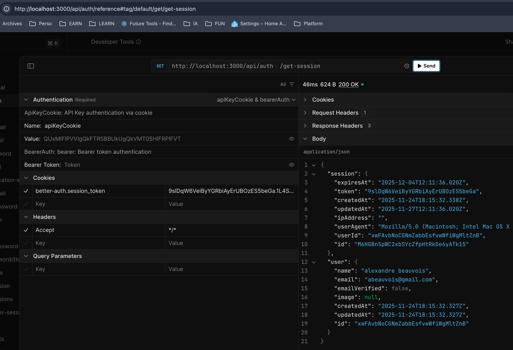
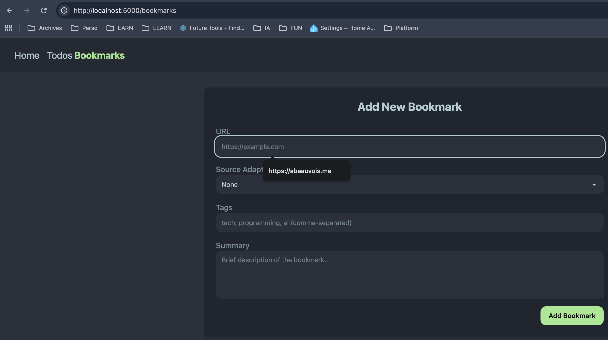

# To run the platform server (rest api = hono server)

```bash
# from `<monorepo root>`
bun run platform:web
# OR also from `<monorepo root>`
cd apps/web
bun run dev
```

# To see the openAPI interface (Swagger)

open browser and type this url

```bash
http://localhost:3000/api/auth/reference
```



# To check if stack is running

## Run an integration test

**Prerequisites:**

1.  Web server must be running at http://localhost:5000
2.  Test user must exist with credentials:
    - Email: test@example.com
    - Password: password123
3.  At least one bookmark should exist in the database

**2. To create the test user:**

```bash
curl -X POST http://localhost:5000/api/auth/sign-up/email \
-H "Content-Type: application/json" \
-d '{"email":"test@example.com","password":"password123","name":"Test User"}'
```

**3.a To add a test bookmark:**

1. Sign in using the client to get session
2. Use createBookmark() method to add bookmarks

3. then run the test:

```bash
cd packages/platform-sdk/
bun run test:integration
```

**OR**

**3.b use the platform UI:**



[how to test with curl](apps/web/server/HOW-TO-CURL.md)
