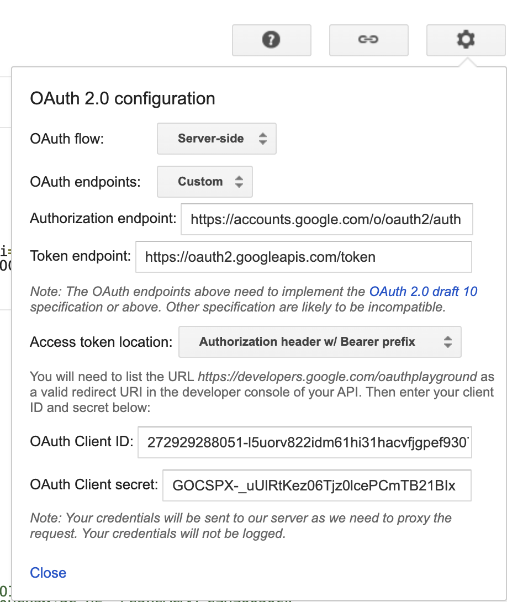

# Gmail OAuth Setup Guide

This guide walks you through obtaining the required Gmail OAuth credentials for the integration tests.

## Prerequisites

You need three credentials in your `.env` file:

- `GMAIL_CLIENT_ID`
- `GMAIL_CLIENT_SECRET`
- `GMAIL_REFRESH_TOKEN`

## Step 1: Set Up Google Cloud Project

1. Go to [Google Cloud Console](https://console.cloud.google.com/)
2. Create a new project or select an existing one
3. Enable the Gmail API:
   - Navigate to **APIs & Services** > **Library**
   - Search for "Gmail API"
   - Click **Enable**

## Step 2: Create OAuth 2.0 Credentials

1. Go to **APIs & Services** > **Credentials**
2. Click **+ CREATE CREDENTIALS** > **OAuth client ID**
3. If prompted, configure the OAuth consent screen:
   - Choose **External** (unless you have a Google Workspace)
   - Fill in the required fields:
     - App name: "Email Links Extractor" (or your preference)
     - User support email: Your email
     - Developer contact information: Your email
   - Click **Save and Continue**
   - On "Scopes" page, click **Save and Continue** (we'll add scopes later)
   - Add yourself as a test user (important!)
   - Click **Save and Continue**
4. Back to creating OAuth client ID:
   - Application type: **Desktop app** or **Web application**
   - Name: "Email Links CLI"
   - If Web application, add authorized redirect URIs:
     - `http://localhost:3000/oauth2callback`
     - `https://developers.google.com/oauthplayground`
   - Click **Create**
5. Download the credentials JSON file (optional) or copy:
   - **Client ID** → Save as `GMAIL_CLIENT_ID`
   - **Client Secret** → Save as `GMAIL_CLIENT_SECRET`

## Step 3: Get Refresh Token (Method 1: OAuth Playground - Easiest)

### Using Google OAuth 2.0 Playground

1. Go to [Google OAuth 2.0 Playground](https://developers.google.com/oauthplayground/)

2. Click the **⚙️ Settings** icon (top right)

   - Check "✓ Use your own OAuth credentials"
   - Enter your **OAuth Client ID**
   - Enter your **OAuth Client Secret**
   - Close settings



3. In the left panel (Step 1):

   - Scroll down to **Gmail API v1**
   - Check these scopes:
     - `https://www.googleapis.com/auth/gmail.readonly`
     - `https://www.googleapis.com/auth/gmail.modify` (if you need to modify emails)
   - Click **Authorize APIs**

4. Sign in with your Google account

   - Choose the account you want to access emails from
   - Click **Allow** to grant permissions
   - You may see a warning "Google hasn't verified this app" if your app is in testing mode
     - Click **Advanced** → **Go to [Your App Name] (unsafe)**
     - Click **Allow**

5. You'll be redirected back to the OAuth Playground
   - In **Step 2**, click **Exchange authorization code for tokens**
   - Copy the **Refresh token** → Save as `GMAIL_REFRESH_TOKEN`

## Step 4: Get Refresh Token (Method 2: Custom Script)

### Using a Node.js/Bun Script

If you prefer to generate the token programmatically:

```typescript
// scripts/get-gmail-token.ts
import { google } from "googleapis";
import http from "http";
import { URL } from "url";
import open from "open";

const CLIENT_ID = "YOUR_CLIENT_ID";
const CLIENT_SECRET = "YOUR_CLIENT_SECRET";
const REDIRECT_URI = "http://localhost:3000/oauth2callback";

const oauth2Client = new google.auth.OAuth2(
  CLIENT_ID,
  CLIENT_SECRET,
  REDIRECT_URI
);

const SCOPES = ["https://www.googleapis.com/auth/gmail.readonly"];

async function getRefreshToken() {
  const authUrl = oauth2Client.generateAuthUrl({
    access_type: "offline",
    scope: SCOPES,
    prompt: "consent", // Force to get refresh token
  });

  console.log("🔐 Opening browser for authorization...");
  console.log("If browser doesn't open, visit this URL:");
  console.log(authUrl);

  await open(authUrl);

  // Create temporary server to receive the callback
  const server = http.createServer(async (req, res) => {
    if (req.url?.startsWith("/oauth2callback")) {
      const url = new URL(req.url, `http://${req.headers.host}`);
      const code = url.searchParams.get("code");

      if (code) {
        res.writeHead(200, { "Content-Type": "text/html" });
        res.end("<h1>✅ Success! You can close this window.</h1>");

        const { tokens } = await oauth2Client.getToken(code);

        console.log("\n✅ Tokens received!");
        console.log("\nAdd these to your .env file:\n");
        console.log(`GMAIL_CLIENT_ID=${CLIENT_ID}`);
        console.log(`GMAIL_CLIENT_SECRET=${CLIENT_SECRET}`);
        console.log(`GMAIL_REFRESH_TOKEN=${tokens.refresh_token}`);

        server.close();
        process.exit(0);
      }
    }
  });

  server.listen(3000, () => {
    console.log("🚀 Listening for OAuth callback on http://localhost:3000");
  });
}

getRefreshToken().catch(console.error);
```

**To use this script:**

```bash
# Install googleapis package (temporary)
bun add googleapis open

# Update the script with your CLIENT_ID and CLIENT_SECRET
# Then run:
bun run scripts/get-gmail-token.ts

# After getting the token, you can remove the packages:
bun remove googleapis open
```

## Step 5: Update .env File

Add the credentials to your `.env` file:

```bash
# Gmail OAuth Credentials
GMAIL_CLIENT_ID=your_actual_client_id_here.apps.googleusercontent.com
GMAIL_CLIENT_SECRET=your_actual_client_secret_here
GMAIL_REFRESH_TOKEN=your_actual_refresh_token_here

# Optional: Filter emails by sender (e.g., only show emails from yourself)
MY_EMAIL_ADDRESS=abeauvois@gmail.com
```

**Note about `MY_EMAIL_ADDRESS`:**

- This is optional - if not provided, all emails will be fetched
- When provided, only emails from this sender will be shown
- Useful for filtering emails you sent to yourself
- The filter uses Gmail's `from:` search operator

## Step 6: Verify the Setup

Run the integration test:

```bash
bun run test:integration gmail
```

Or specifically:

```bash
bun test src/infrastructure/tests/integration/gmail/test-gmail-credentials.test.ts
```

## Troubleshooting

### Error: "invalid_grant"

**Causes:**

- Refresh token expired or revoked
- OAuth consent screen not properly configured
- App is in "Testing" mode but you're not added as a test user

**Solution:**

1. Go to Google Cloud Console → OAuth consent screen
2. Add yourself as a test user under "Test users"
3. Or publish the app (requires verification for sensitive scopes)
4. Regenerate the refresh token using OAuth Playground

### Error: "invalid_client"

**Causes:**

- Wrong Client ID or Client Secret
- Credentials from a different project
- Desktop app credentials used with web redirect URI (or vice versa)

**Solution:**

1. Verify credentials in Google Cloud Console
2. Ensure you're using credentials from the same project where Gmail API is enabled
3. Check that redirect URIs match (if using web application type)

### Error: "Access Not Configured"

**Cause:**

- Gmail API not enabled for the project

**Solution:**

1. Go to APIs & Services → Library
2. Search for "Gmail API"
3. Click Enable

### Refresh Token Not Returned

**Cause:**

- `access_type: 'offline'` not set
- User already authorized the app previously

**Solution:**

1. In OAuth Playground, revoke access: Settings → Reset OAuth
2. Or revoke access at: https://myaccount.google.com/permissions
3. Re-authorize with `prompt: 'consent'` parameter (forces re-consent)

### App is in Testing Mode Warning

**What it means:**

- Your OAuth consent screen is in "Testing" status
- Only test users can authorize the app
- Refresh tokens may expire after 7 days (but usually don't if app is used regularly)

**Solution (for personal use):**

- Add yourself as a test user - this is fine for development
- The 7-day expiration typically doesn't apply if you're actively using the app

**Solution (for production):**

- Publish the app (requires Google verification for sensitive scopes)
- Or keep it in testing mode and add all users as test users (max 100)

## Security Notes

⚠️ **Important Security Practices:**

1. **Never commit credentials to git:**

   - Ensure `.env` is in `.gitignore`
   - Never hardcode credentials in source code

2. **Refresh tokens are sensitive:**

   - They allow long-term access to Gmail
   - Treat them like passwords
   - Rotate them periodically

3. **Limit scope access:**

   - Only request scopes you actually need
   - Use `gmail.readonly` if you don't need to modify emails

4. **For production:**
   - Use service accounts if possible (for workspace)
   - Implement token encryption at rest
   - Add token revocation endpoint
   - Monitor for suspicious activity

## Alternative: Service Account (Google Workspace Only)

If you have a Google Workspace domain, you can use a service account with domain-wide delegation instead of OAuth tokens:

1. Create a service account in Google Cloud Console
2. Enable domain-wide delegation
3. Grant Gmail API access in Workspace Admin Console
4. Use service account credentials instead of OAuth tokens

This is more secure for server-side applications but only works with Google Workspace accounts.

## References

- [Google OAuth 2.0 Documentation](https://developers.google.com/identity/protocols/oauth2)
- [Gmail API Quickstart](https://developers.google.com/gmail/api/quickstart/nodejs)
- [OAuth 2.0 Playground](https://developers.google.com/oauthplayground/)
- [Google Cloud Console](https://console.cloud.google.com/)
